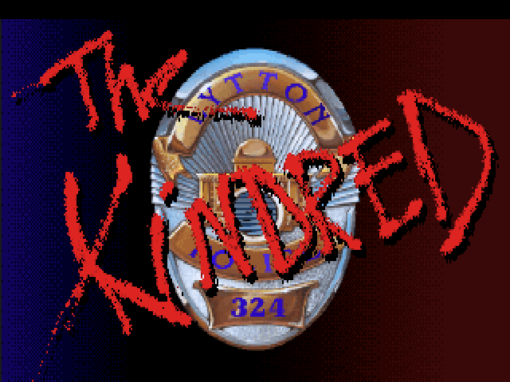
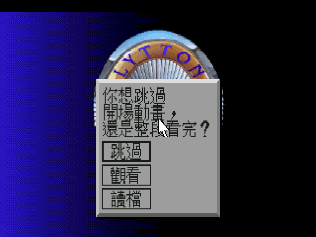
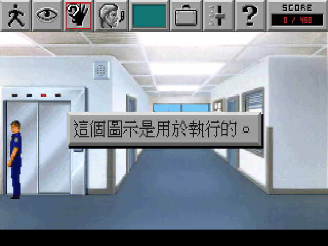
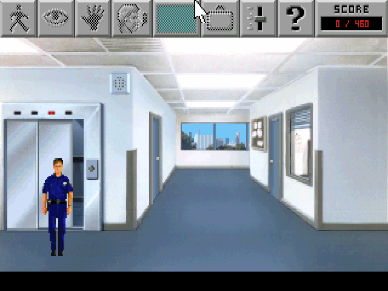
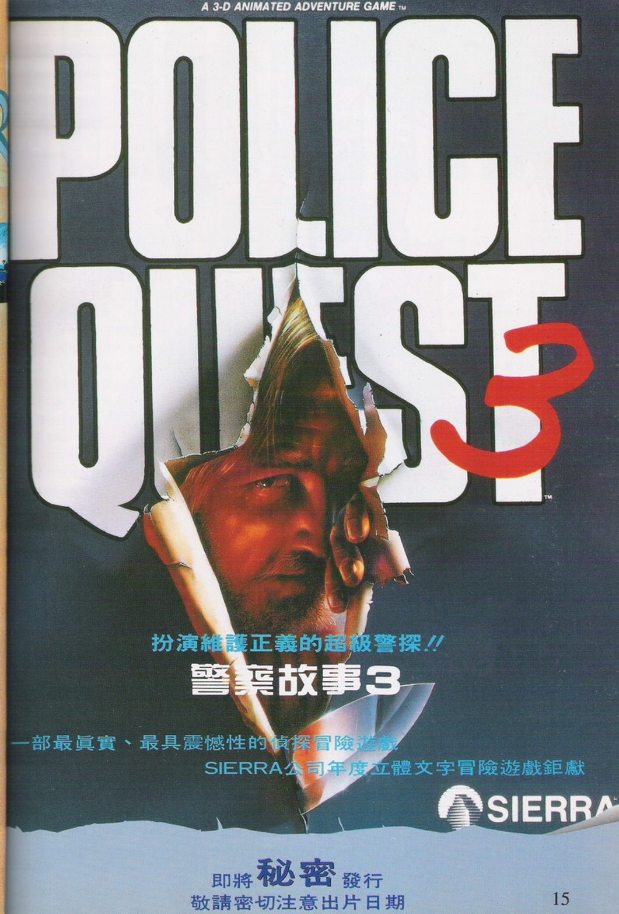
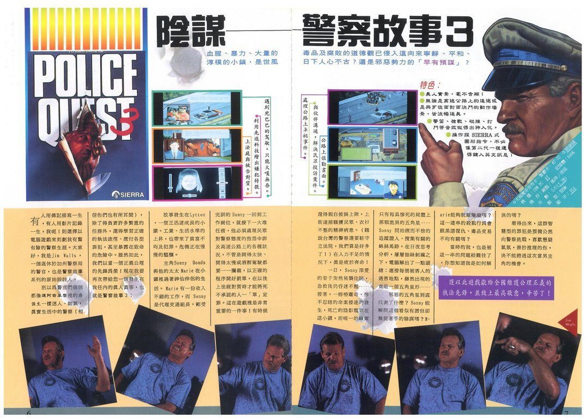
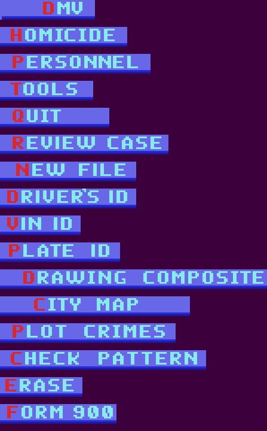
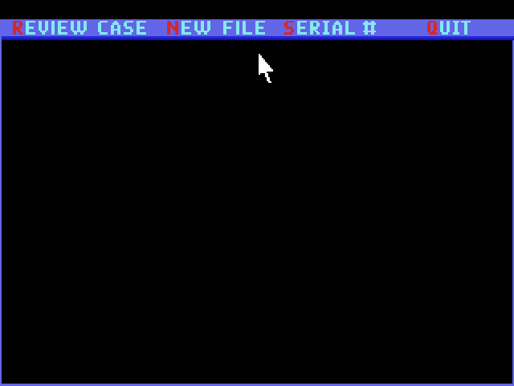
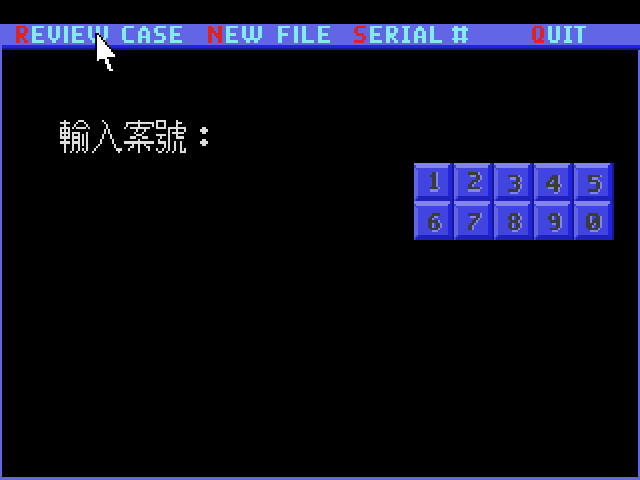

# 警察故事Ⅲ 陰謀　繁體中文化

*Police Quest 3: The Kindred*

你剛結束警佐訓練，第一天回到 Lytton 警局上工。妻子 Marie 在 Oak Tree Mall 找到了工作，日子總算安穩下來——直到下午那通無線電：購物中心停車場有人遇襲，被連刺數刀，送往 Lytton 綜合醫院。躺在急救床上的是你太太。

醫生說她撐過來了，但陷入昏迷。你回到局裡，桌上還堆著別的案子：一樁命案、一份針對交通組女警 Pat Morales 的民眾申訴、一份要你簽的加班表。這座小鎮這幾年開始有毒品流進來，有些案子看起來不像單獨事件。而你必須照規矩辦事——回報、搜身、登錄證物，少一步就扣分。

這個專案把這條路上的每一句話翻成繁體中文：**2,874 則遊戲文字**（其中 2,772 則有中譯，其餘是人名與地址，照當年慣例保留原文）、開場動畫問句、道具欄說明、存讀檔對話框、片尾致謝的職稱。中文以 640×400 直接繪進畫面，不是把 320×200 的字放大，所以筆劃是實心銳利的。

這裡只有 ScummVM 的引擎修改與中文資料，**不含遊戲本體**，你需要自備一份 Police Quest 3 的 DOS 版。想直接開始，跳到〈安裝與遊玩〉。



四十秒的[推廣片](https://github.com/wicanr2/police-quest-3-cht/releases/download/v1.2/pq3-cht-promo.mp4)（英文原版與中文化左右對照，配樂是原版遊戲音樂）。

---

## 畫面

| | |
|---|---|
|  |  |
|  | |

## 當年的廣告

這款遊戲在台灣上市時，雜誌上登過一整頁的彩色廣告。撕開的紙面後面是一張男人的臉，
標題壓著紅色的 `3`，中文標語寫著「扮演維護正義的超級警探!!」，下面兩行是
「一部最真實、最具震憾性的偵探冒險遊戲」與「SIERRA 公司年度立體文字冒險遊戲鉅獻」。
頁面最底下還留著兩行「即將秘密發行」「敬請密切注意出片日期」，「秘密」兩個字特別放大——
那時候連上市日期都當作懸念在賣。



**中文名沿用當年實際使用的名稱，本專案沒有另外取名。** 這張廣告用的是「警察故事3」，
《軟體世界》珍藏版 134 則作「警察故事Ⅲ陰謀」；本專案標題採後者，副標「陰謀」也是從那裡來的。
介紹跨頁的大標「陰謀——警察故事3」印證了同一個名字。

同一批資料裡還有一份跨頁介紹，標題是「陰謀——警察故事3」，附了遊戲特色條列、
六張實機畫面，以及一篇 Jim Walls 的具名專文中譯。特色那一欄列的是「真人實景，毫不含糊！」、
「警笛、槍聲、碰撞、打鬥等音效做得出神入化」，還有「操作採 SIERRA 式圖形指令，
不必像第二代一樣還得鍵入英文訊息！」——最後這句是當年的賣點：這一代改成圖示操作，
不必再打字下指令了。




<sub>圖片為 1990 年代台灣電腦遊戲雜誌的《警察故事3》廣告與介紹，掃描件收於
[`docs/scans/banner/`](docs/scans/banner/)，出處見該目錄的 `SOURCE.md`。</sub>

## 這個版本翻了什麼

| 項目 | 狀態 |
|---|---|
| 對白、旁白、場景描述 | ✅ 全數中文 |
| 道具欄與圖示說明 | ✅ |
| 開場「要不要跳過動畫」對話框 | ✅ |
| 存讀檔／刪除存檔對話框 | ✅ |
| 片尾致謝的段落標題與角色職稱 | ✅（人名保留英文） |
| 分數／時間顯示 | ✅（`%d／%d` 動態句） |
| 人名、地名、街道地址 | 保留英文原文（見下） |
| 圖示列上的 `SCORE` 字樣 | ❌ 烘在美術裡，未處理 |
| 警用電腦的功能列 | ❌ 烘在美術裡，尺寸塞不下中文，見〈已知問題〉 |

### 譯名為什麼保留英文

《軟體世界》第 35–37 期的〈警察故事3 完全攻略〉把 `Sonny Bonds`、`Lytton`、`Jessie Bains`、`Marie`、`Pat Morales` 直接以英文嵌在中文句子裡。前作《警察故事》的中文化也是這個做法。本專案沿用，理由是一手資料優先於後來的推論。完整對照見 [`translation/glossary.tsv`](translation/glossary.tsv)。

警階與警務術語則全部中譯：`Sergeant` → 警佐、`dispatch` → 勤務中心、`10-4` → 收到。
`Officer` 分兩種：階級稱謂譯「警員」，當面稱呼譯「警官」——台灣中文對警察當面就是叫警官，一律改成警員反而不自然。

## 安裝與遊玩

三個平台都出 patch 版（只有引擎與中文資料，玩家自備遊戲）：

| 平台 | 檔案 | 大小 |
|---|---|---|
| Linux | `PQ3-CHT-patch-linux-x86_64.AppImage` | 約 13 MB |
| Windows | `PQ3-CHT-patch-win64.zip` | 約 11 MB |
| macOS | `PQ3-CHT-patch-macos-universal.tar.gz`（arm64 + x86_64） | 約 16 MB |

三個包裡的 `ENGINE.txt` 都記著同一組引擎指紋，這是用來擋「中文資料沒變、
但包裡裝著舊 binary」的——那種狀況下只比對資料 md5 會全綠。

macOS 首次執行要先跑包內的 `修復－macOS.command`（未簽署的 app 會被 Gatekeeper 擋，
那支會移除隔離屬性並重新 ad-hoc 簽章）。

你需要：

1. 一份 Police Quest 3 的 DOS 版（`RESOURCE.MAP` + `RESOURCE.000`～`.004`）。
2. 本專案 `dist-cht/` 的三個中文資料檔：`translation.tsv`、`pq3_big5.fnt`、`pq3_big5_hi.fnt`。
3. 一份套過 `patches/` 的 ScummVM。

啟動時把中文資料夾指給 `--extrapath`，語言指定 `tw`：

```bash
scummvm --path=<遊戲資料夾> --extrapath=<dist-cht 資料夾> --auto-detect --language=tw
```

`--language=tw` 能生效是因為 patch 放寬了 detector 的語言過濾（Sierra 的英文條目都標成 `EN_ANY`，原本會拒絕 `ZH_TWN` 的請求）。

## 自己編一份

```bash
# 1. 取 pinned 的 ScummVM（版本見 patches/UPSTREAM_COMMIT.txt）
git clone https://github.com/scummvm/scummvm.git scummvm-src
cd scummvm-src && git checkout $(cat ../patches/UPSTREAM_COMMIT.txt)

# 2. 套 patch（fontchinese.* 是新檔，直接複製）
patch -p1 < ../patches/0001-sci-cht-zh_twn.patch
cp ../patches/fontchinese.{cpp,h} engines/sci/graphics/

# 3. 編（MT-32 一定要編進去，別帶 --disable-mt32emu）
./configure --disable-all-engines --enable-engine=sci
make -j
```

`tools/build_engine.sh` 是包了 docker 的同一件事。

### 重烘中文資料

字型是從譯文實際用到的字烘出來的，所以改了譯文就要重烘：

```bash
python3 tools/build_cht.py translation/translation_utf8.tsv dist-cht --size 15 --eten <倚天字型目錄>
python3 tools/bake_hires_font.py dist-cht/pq3_big5_hi.fnt translation/translation_utf8.tsv \
        --width 32 --height 30 --size 29 --eten <倚天字型目錄>
```

字模來源是**倚天中文系統的點陣字**，不是 TTF 縮圖——1990 年代 DOS 中文遊戲的字就長這樣，TTF 縮到 15px 會糊掉。目前 1,953 個字全部命中倚天字庫，TTF fallback 為 0。

改完譯文請先跑驗證再烘：

```bash
python3 tools/validate_batches.py translation/full_skeleton.tsv translation/batch/
```

它會檢查 key 是否逐字元對得上（差一個尾端空白，引擎就會靜默退回英文）、`%` 格式符數量與順序、`\n` 數量、以及每個字是否都在 Big5 內。

**譯文的唯一真相是 `translation/translation_utf8.tsv`**，要改就改它。`translation/batch/`
是當初分批翻譯的歷史輸入，`tools/merge_translations.py` 是當時的合併工具——它以
`strip()` 後的英文當 key，而本作有 5 組「只差前後空白、譯文也不同」的配對
（`    Quit    ` → `    離開    ` 與 `Quit` → `離開`，選單按鈕靠那些空白對齊），
它表達不了。拿它的輸出覆蓋 master 會把那 5 組靜默塌成一個值，所以那支現在會直接拒絕寫入 master。

### 驗收

```bash
tools/verify_packages.sh                    # 六個包：中文資料反查缺件 + md5 + 引擎指紋 + 遊戲資源
tools/verify_packages.sh --self-test        # 正對照：故意造壞包，確認每條規則都叫得出來
tools/smoke_appimage.sh <包> <輸出目錄>      # 開機實測：進遊戲、逼出一句中文並截圖
```

前者驗「包裡有什麼」，後者驗「包跑不跑得起來」——AppRun 路徑寫錯、字型載不進去、
ROM 沒被認出來，靜態檢查全部看不到。

## 已知問題

- **警用電腦的所有功能列仍是英文，而且做不了。** 那些字不是遊戲文字，是**烘進美術的點陣圖**——
  `view.197` 裡有 16 個 cel，涵蓋整套電腦介面：`DMV`、`HOMICIDE`、`PERSONNEL`、`TOOLS`、`QUIT`、
  `REVIEW CASE`、`NEW FILE`、`DRIVER'S ID`、`VIN ID`、`PLATE ID`、`DRAWING COMPOSITE`、
  `CITY MAP`、`PLOT CRIMES`、`CHECK PATTERN`、`ERASE`、`FORM 900`，每一項還有一般與反白兩份。

  

  做不了的理由是量出來的：**cel 高 11 px，文字帶只有 10 列**，而倚天點陣字最小是 15 列。
  差 5 列不是靠參數能補的，硬塞會蓋掉上下的框線。

  

- **終端機的欄位式記錄表（`VICTIM - `、`LOCATION - ` 這類）沒有實機驗過。**
  終端機本身是好的——提示字已確認顯示為「輸入案號：」，位置與字距都正常：

  

  沒驗到的是把案號輸進去之後那張記錄表。那種畫面走 `kernelDisplay` 的絕對座標，
  行距照 8px 拉丁字型排，中文字較高，前作 PQ1 在同型畫面上出現過上下兩行相黏。
  用除錯器直接跳到那個房間拿到的是**空的遊戲進度**（案號要玩到第二天才建檔），
  查詢一定回空、欄位根本不會畫出來，所以只能靠實際玩到那裡才驗得到。
  **如果你玩到查詢畫面發現字黏在一起，請開 issue 附截圖。**

- **圖示列上的 `SCORE` 字樣是美術**，要換得重繪 cel，目前保留英文。

- 畫面左上角偶爾閃出紅色數字殘影：那是時間顯示從收起中的圖示列下緣露出來，**英文原版一模一樣**，不是中文化造成的。

## 當年的中文資料

除了上面那兩頁廣告，這款遊戲在台灣還有《軟體世界》連載三期的完全攻略，
以及一篇 Jim Walls 的作者訪談。那些內容散佚得很快，所以一併收在這裡。

| 文件 | 內容 |
|---|---|
| [`docs/手冊要點.md`](docs/手冊要點.md) | 原版盒裝勤務手冊的中文要點。**含無線電代碼、車輛法規代碼、刑法條號三張表**——遊戲要你照手冊查表輸入，查不到就過不去 |
| [`docs/攻略.md`](docs/攻略.md) | 依《軟體世界》第 35–37 期連載整理的流程攻略。**未實機驗證** |
| [`docs/作者訪談.md`](docs/作者訪談.md) | Jim Walls 的背景：真警察出身、槍戰負傷退休、寫進遊戲的警務程序 |
| [`docs/lessons-pq3.md`](docs/lessons-pq3.md) | 這輪查證過的技術結論，以及一項仍待實機驗證的開放問題 |

掃描件原件分四個目錄收著，各附 `SOURCE.md` 記出處與頁碼：

| 目錄 | 內容 |
|---|---|
| [`docs/scans/banner/`](docs/scans/banner/) | 代理商廣告與中文介紹跨頁（上面那兩張） |
| [`docs/scans/walkthrough-sw35/`](docs/scans/walkthrough-sw35/) | 《軟體世界》第 35 期〈完全攻略（一）〉，5 頁 |
| [`docs/scans/walkthrough-sw36/`](docs/scans/walkthrough-sw36/) | 第 36 期〈完全攻略（二）〉，4 頁 |
| [`docs/scans/walkthrough-sw37/`](docs/scans/walkthrough-sw37/) | 第 37 期〈完全攻略（三）〉，5 頁 |
| [`docs/scans/interview/`](docs/scans/interview/) | 〈警察故事作者訪談〉，2 頁 |

雜誌文章的著作權不屬於本專案。上面幾份 `docs/` 文件是讀完之後用自己的話重寫的，
不是逐字重刊；掃描件保留原件供查證與史料保存。

## 專案結構

```
patches/       ScummVM 引擎修改（0001 + fontchinese.cpp/h）與 pinned commit
dist-cht/      執行期中文資料：translation.tsv + 兩份 Big5 字型
translation/   譯文原始檔（UTF-8）、譯名表、翻譯規範、抽字骨架
tools/         抽字、烘字、驗證、view/pic 編解碼、headless 擷取
docker/        各階段的建置環境
```

## 授權與致謝

引擎修改沿用 ScummVM 的 GPLv3。遊戲本體、美術、音樂的著作權屬於原權利人，本專案不散布任何遊戲資源。

《警察故事》系列的腳本出自 **Jim Walls**——他在加州公路巡邏隊服務多年，一次勤務中的槍戰讓他負傷退休，之後把真實的警務程序寫進了遊戲。這系列之所以要求玩家照規矩辦事，原因就在這裡。
